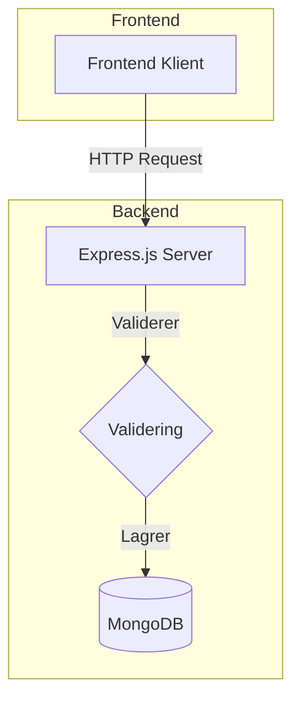
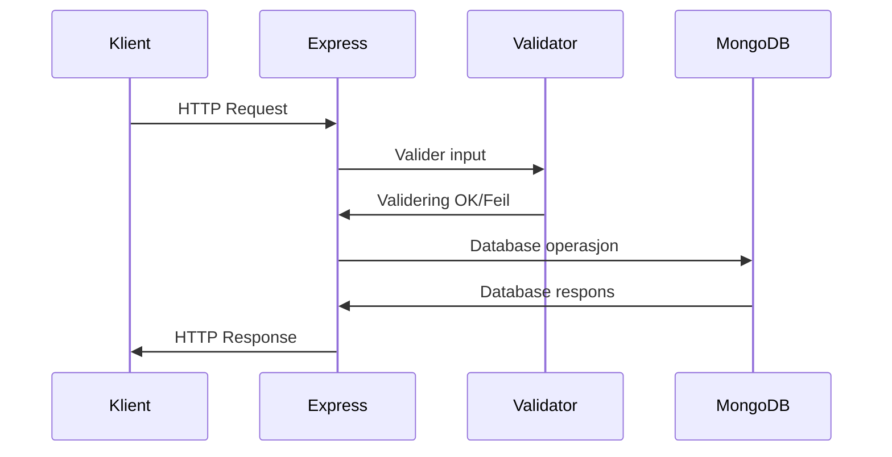
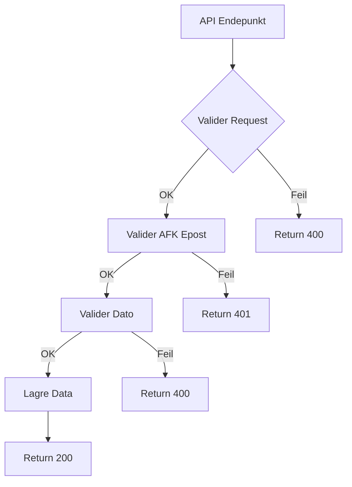
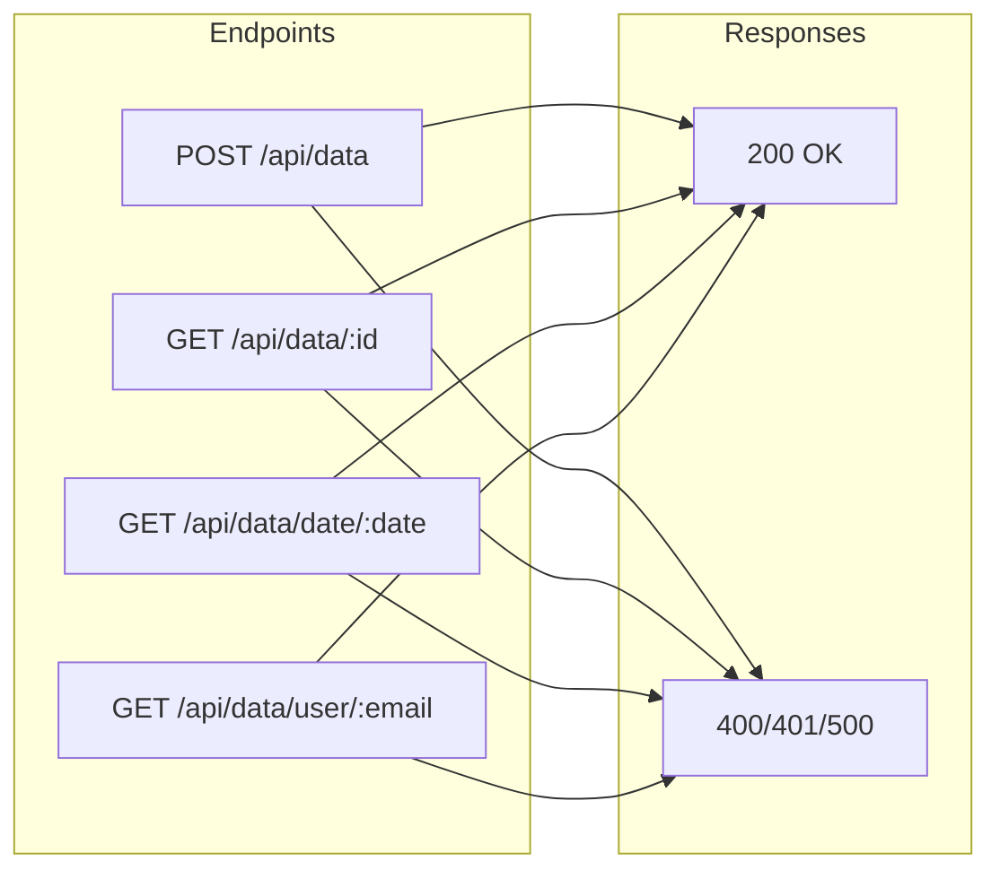
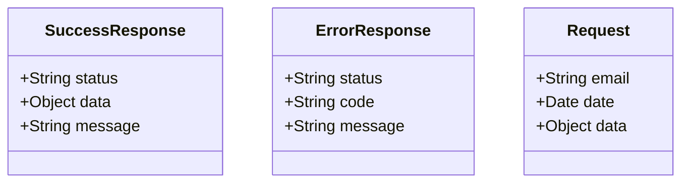

# Iterasjon-1-RESTful-API

## TASK: Fysisk Systemarkitektur



## TASK: Flytdiagram Systemarkitektur




## TASK: Flytdiagram Software



## TASK: Funksjonell Beskrivelse



## TASK: Standard for Svar og Forespørsel



## TASK: Testing

Skal bruke postman til å teste API-et. Node.js backend kjører på localhost port 3000 eller hva enn du oppgir i ENV filen. MongoDB er connected og tilgjengelig. Postman er installert og kan brukes.
### Brukervalidering
```javascript

// Test: Validere AFK Epost
POST http://localhost:3000/api/data
{
    "email": "test@afk.no",
    "date": "2024-03-18",
    "data": {"title": "Test"}
}

// Forventet resultat: 200 OK
// Test med ugyldig epost
{
    "email": "test@gmail.com",
    "date": "2024-03-18",
    "data": {"title": "Test"}
}
// Forventet resultat: 400 Bad Request
```

### Datovalidering
```javascript
// Test: Validere Datoinput
POST http://localhost:3000/api/data
{
    "email": "test@afk.no",
    "date": "2024-13-45",  // Ugyldig dato
    "data": {"title": "Test"}
}
// Forventet resultat: 400 Bad Request
```

### CRUD Operasjoner
```javascript
// Test Suite: CRUD
// 1. Opprett data
POST http://localhost:3000/api/data
{
    "email": "test@afk.no",
    "date": "2024-03-18",
    "data": {"title": "Test"}
}

// 2. Hent data
GET http://localhost:3000/api/data/date/2024-03-18

// 3. Hent brukerdata
GET http://localhost:3000/api/data/user/test@afk.no
```

## Testing with Postman

### Prerequisites
- Node.js server running on port 3000
- MongoDB running locally
- Postman installed

### Test Cases

#### 1. Create Data (POST)
```http
POST http://localhost:3000/api/data

Headers:
Content-Type: application/json

Body:
{
    "email": "test@afk.no",
    "date": "2024-03-18",
    "content": {"title": "Test", "description": "Any valid JSON works here"}
}
```

Expected Response (201):
```json
{
    "status": "success",
    "data": {
        "email": "test@afk.no",
        "date": "2024-03-18T00:00:00.000Z",
        "content": {
            "title": "Test",
            "description": "Any valid JSON works here"
        }
    }
}
```

#### 2. Get Data by Date (GET)
```http
GET http://localhost:3000/api/data/date/2024-03-18
```

Expected Response (200):
```json
{
    "status": "success",
    "data": [
        {
            "email": "test@afk.no",
            "date": "2024-03-18T00:00:00.000Z",
            "content": {
                "title": "Test",
                "description": "Any valid JSON works here"
            }
        }
    ]
}
```

### Validation Rules
- Email must end with @afk.no
- Date must be in ISO format (YYYY-MM-DD)
- Content must be valid JSON

### Common Errors
- 400: Invalid email format or domain
- 400: Invalid date format
- 400: Invalid JSON content
- 500: Database or server error

