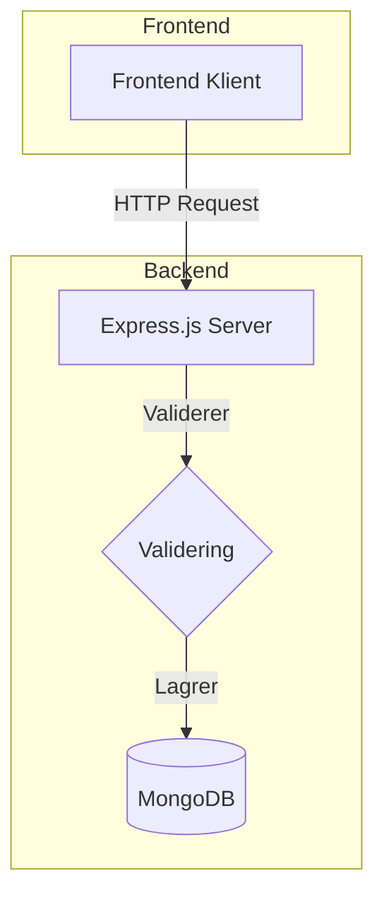
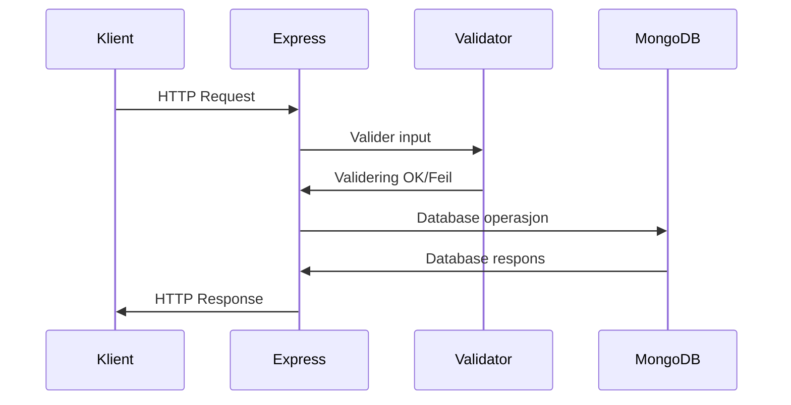
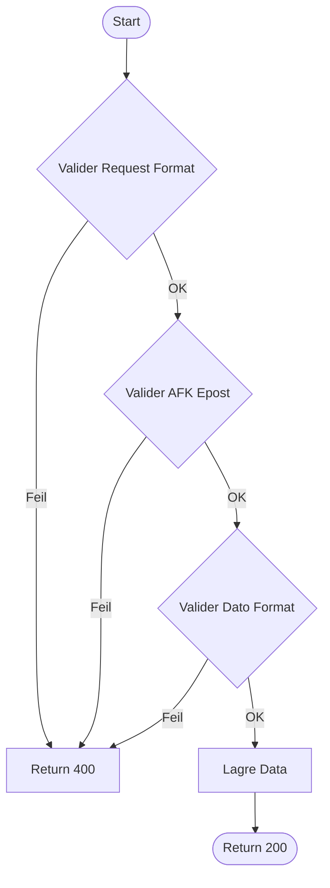
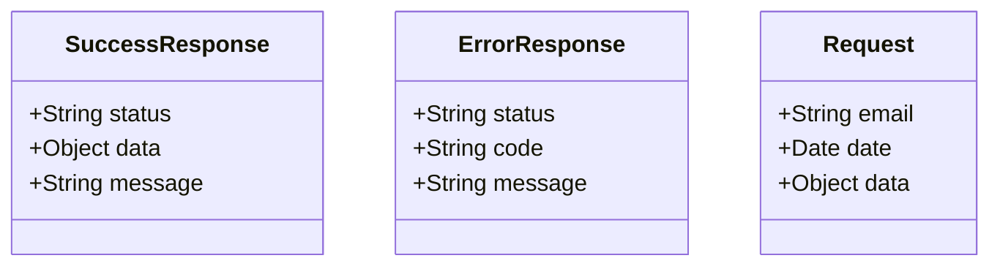
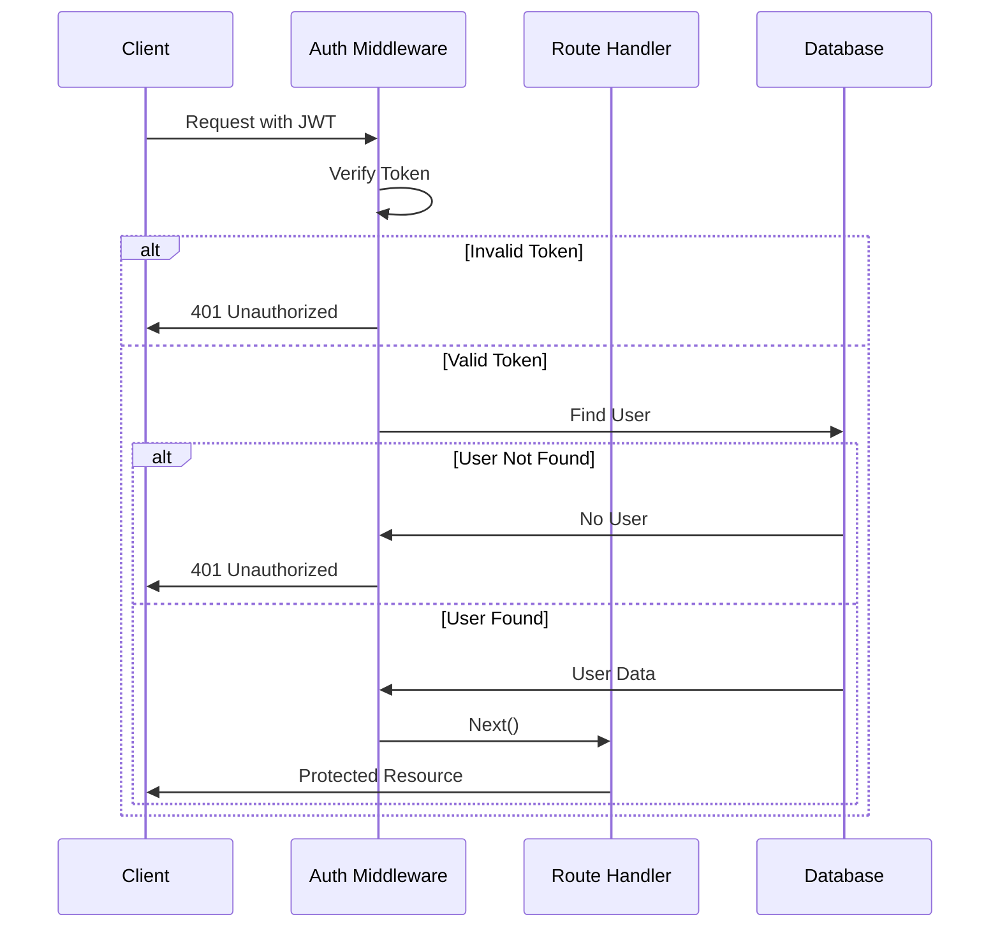

# RESTful-API-Mars

## TASK: Fysisk Systemarkitektur



## TASK: Flytdiagram Systemarkitektur




## TASK: Flytdiagram Software


### API Endpoints TASK: Funksjonell Beskrivelse

#### POST /api/data
Creates a new data entry in the system.
- Requires valid @afk.no email
- Validates date format
- Accepts JSON content up to 1MB
- Returns 201 on success with created data

#### GET /api/data/:id 
Retrieves a specific data entry by its ID.
- Returns 200 with data if found
- Returns 404 if not found

#### GET /api/data/date/:date
Retrieves all data entries for a specific date.
- Date must be in YYYY-MM-DD format
- Returns array of matching entries
- Returns empty array if no entries found

#### GET /api/data/user/:email
Retrieves all data entries for a specific user email.
- Email must be valid @afk.no address
- Returns array of user's entries
- Returns empty array if no entries found


## TASK: Standard for Svar og Forespørsel



## TASK: Testing

Skal bruke postman til å teste API-et. Node.js backend kjører på localhost port 3000 eller hva enn du oppgir i ENV filen. MongoDB er connected og tilgjengelig. Postman er installert og kan brukes.
### Brukervalidering
```javascript

// Test: Validere AFK Epost
POST http://localhost:3000/api/data
{
    "email": "test@afk.no",
    "date": "2024-03-18",
    "data": {"title": "Test"}
}

// Forventet resultat: 200 OK
// Test med ugyldig epost
{
    "email": "test@gmail.com",
    "date": "2024-03-18",
    "data": {"title": "Test"}
}
// Forventet resultat: 400 Bad Request
```

### Datovalidering
```javascript
// Test: Validere Datoinput
POST http://localhost:3000/api/data
{
    "email": "test@afk.no",
    "date": "2024-13-45",  // Ugyldig dato
    "data": {"title": "Test"}
}
// Forventet resultat: 400 Bad Request
```

### CRUD Operasjoner
```javascript
// Test Suite: CRUD
// 1. Opprett data
POST http://localhost:3000/api/data
{
    "email": "test@afk.no",
    "date": "2024-03-18",
    "data": {"title": "Test"}
}

// 2. Hent data
GET http://localhost:3000/api/data/date/2024-03-18

// 3. Hent brukerdata
GET http://localhost:3000/api/data/user/test@afk.no
```

## Testing with Postman

### Prerequisites
- Node.js server running on port 3000
- MongoDB running locally
- Postman installed

### Test Cases

#### 1. Lag Data (POST)
```http
POST http://localhost:3000/api/data

Headers:
Content-Type: application/json

Body:
{
    "email": "test@afk.no",
    "date": "2024-03-18",
    "content": {"title": "Test", "description": "Any valid JSON works here"}
}
```

Expected Response (201):
```json
{
    "status": "success",
    "data": {
        "email": "test@afk.no",
        "date": "2024-03-18T00:00:00.000Z",
        "content": {
            "title": "Test",
            "description": "Any valid JSON works here"
        }
    }
}
```

#### 2. Fetch Data med Date (GET)
```http
GET http://localhost:3000/api/data/date/2024-03-18
```

Expected Response (200):
```json
{
    "status": "success",
    "data": [
        {
            "email": "test@afk.no",
            "date": "2024-03-18T00:00:00.000Z",
            "content": {
                "title": "Test",
                "description": "Any valid JSON works here"
            }
        }
    ]
}
```

### Validation Rules
- Email must end with @afk.no
- Date must be in ISO format (YYYY-MM-DD)
- Content must be valid JSON
- Content size must not exceed 1MB

### Common Errors
- 400: Invalid email format or domain
- 400: Invalid date format
- 400: Invalid JSON content
- 400: Content size exceeds 1MB limit
- 500: Database or server error

## Express Validator Implementation

### Overview
Express-validator er et middleware som validerer incoming requests før de reacher router handlersene dine. 

### Hvordan det funker i mitt prosjekt

1. Validation Chain in `utils/validateData.js`:
```javascript
// Email validation
body('email')
    .trim()                    // Remove whitespace
    .isEmail()                 // Check if valid email format
    .matches(/@afk\.no$/)     // Må ende med @afk.no

// Date validation
body('date')
    .isISO8601()              // Must be YYYY-MM-DD format
    .custom(value => {        // Custom validation
        const date = new Date(value);
        return !isNaN(date.getTime());
    })

// Content validation
body('content')
    .custom((value) => {      // Custom validation for JSON
        if (typeof value === 'object') return true;
        try {
            JSON.parse(value);
            return true;
        } catch (e) {
            throw new Error('Invalid JSON');
        }
    })
```

### Validation Flow
1. Request treffer endpoint `/api/data`
2. Express-validator middleware prosseserer denne requesten
3. Hvert field er validert i følge de reglene jeg har satt opp 
4. Resultetatene er da collecta
5. Og i controlleren så sjekker den validations resultatene
```javascript
const errors = validationResult(req);
if (!errors.isEmpty()) {
    return res.status(400).json({
        status: 'error',
        errors: errors.array()
    });
}
```

### Testing i Postman (eller Thunderclient, men jeg brukte Postman)
```http
POST http://localhost:3000/api/data
Content-Type: application/json

// Valid Request
{
    "email": "test@afk.no",          // Must end with @afk.no
    "date": "2024-03-18",            // Must be valid ISO date
    "content": {"title": "Test"}      // Must be valid JSON
}

// Common Validation Errors:
{
    "email": "test@gmail.com",        // Wrong domain
    "date": "2024-13-45",            // Invalid date
    "content": "{broken json}"        // Invalid JSON
}
```

### Validation Response Eksempler
```json
// Success (201)
{
    "status": "success",
    "data": {
        "email": "test@afk.no",
        "date": "2024-03-18T00:00:00.000Z",
        "content": {"title": "Test"}
    }
}

// Validation Error (400)
{
    "status": "error",
    "errors": [
        {
            "type": "field",
            "msg": "Must be an AFK email address",
            "path": "email",
            "location": "body"
        }
    ]
}
```

## Authentication & Authorization

### User Roles
The API implements three levels of authorization:
- `superadmin`: Highest level of access
- `admin`: Administrative access
- `user`: Basic access

### Authentication Flow


### API Endpoints for Auth

#### Register New User
```http
POST /api/register
Content-Type: application/json

{
    "email": "user@afk.no",
    "password": "password123",
    "password2": "password123"
}
```

Response (201):
```json
{
    "status": "success",
    "token": "your.jwt.token"
}
```

#### Login User
```http
POST /api/login
Content-Type: application/json

{
    "email": "user@afk.no",
    "password": "password123"
}
```

Response (200):
```json
{
    "status": "success",
    "token": "your.jwt.token"
}
```

### Protected Routes
All data routes require authentication. Include the JWT token in the Authorization header:
```http
Authorization: Bearer your.jwt.token
```

#### Role-Based Access
- `/api/data` (POST) - Requires authentication
- `/api/data/date/:date` (GET) - Requires authentication
- `/api/data/user/:email` (GET) - Requires admin or superadmin role

### Error Responses

#### Authentication Errors
```json
{
    "status": "error",
    "message": "Du er ikke logga inn"
}
```

#### Authorization Errors
```json
{
    "status": "error",
    "message": "Du har ikke tilgang!"
}
```

#### Invalid Token
```json
{
    "status": "error",
    "message": "Invalid token"
}
```

### Security Features
- JWT-based authentication
- Password hashing with bcrypt
- Role-based access control
- Token expiration (24 hours)
- Email domain validation (@afk.no)
- Password confirmation on registration

